# 个人垃圾分类小程序项目

## 一、技术点

后端：SpringBoot + JWT + Redis + MyBatis-Plus + Swagger + OSS

管理员端：Vue + axios

用户端：微信小程序 + 语音识别 + 图像识别 + 导航模块

图像识别功能：采用Yolov4目标检测算法自己训练模型

## 二、效果展示

### 1. 小程序

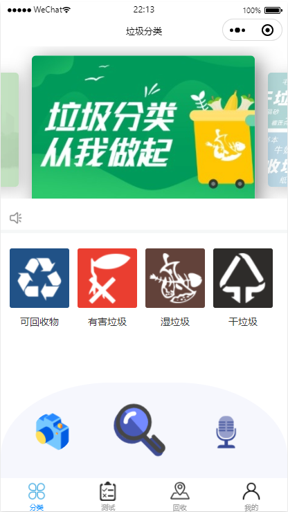

**语音识别模块**

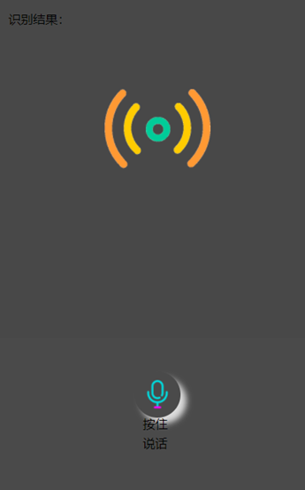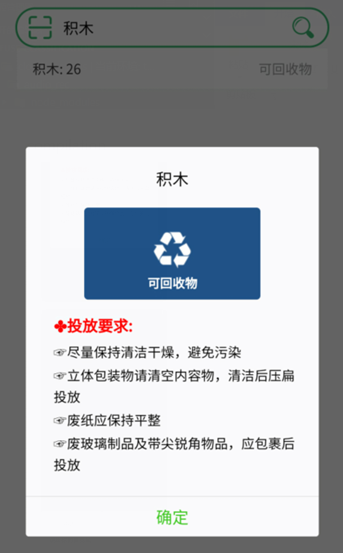

**图像识别模块**

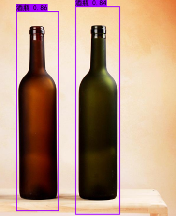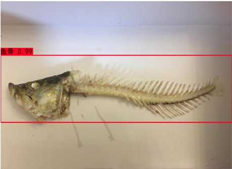

**知识问答模块**

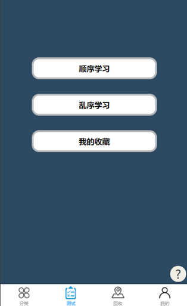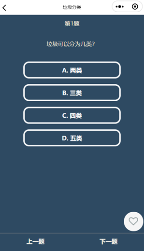

**垃圾回收模块**

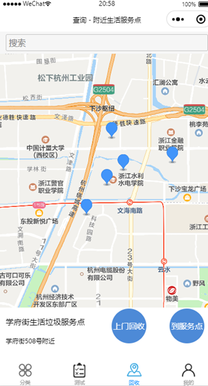

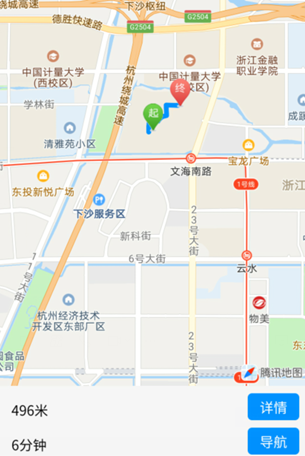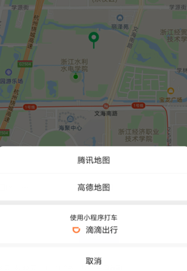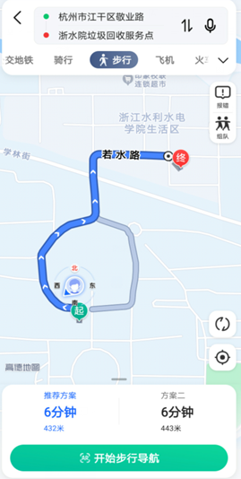

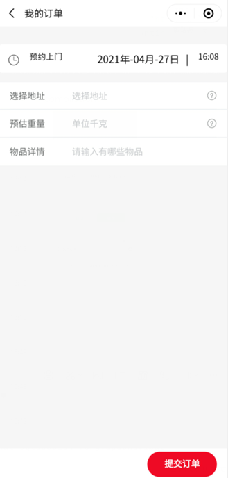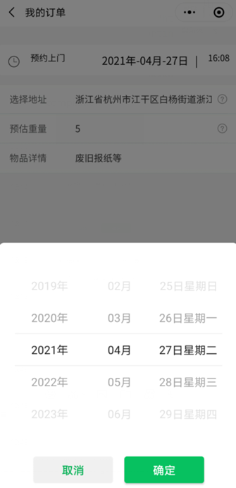

**个人中心模块**

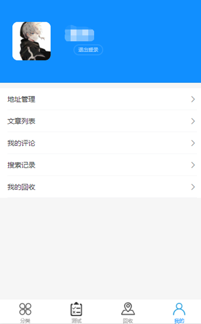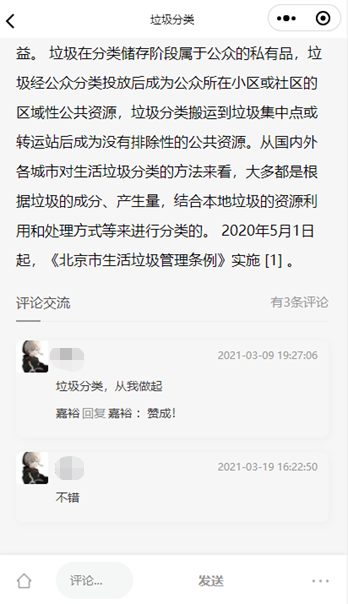

### 2. 管理员页面

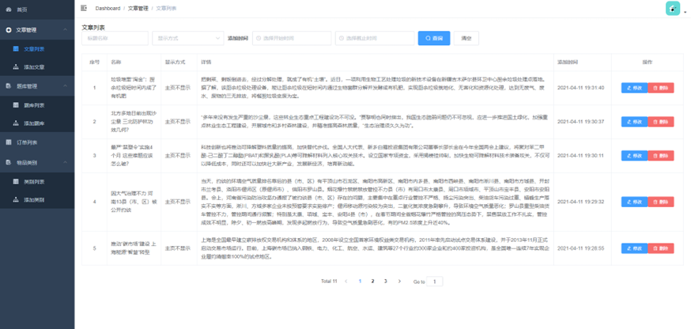

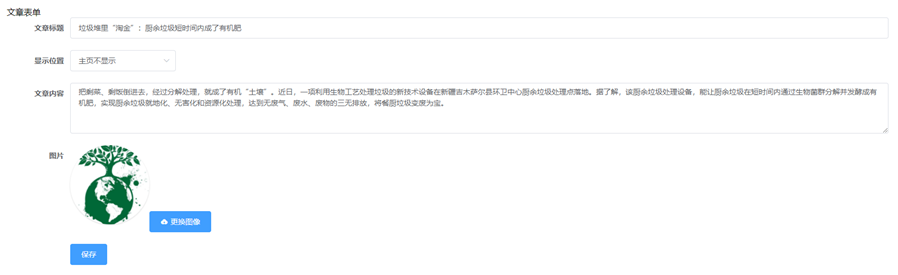

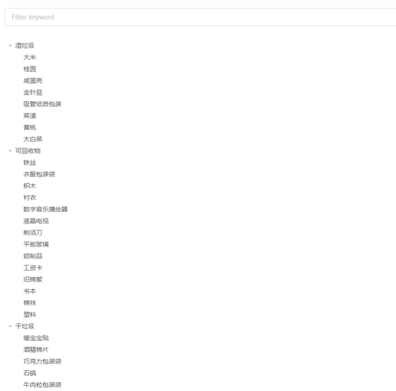

### 3. 后端项目目录

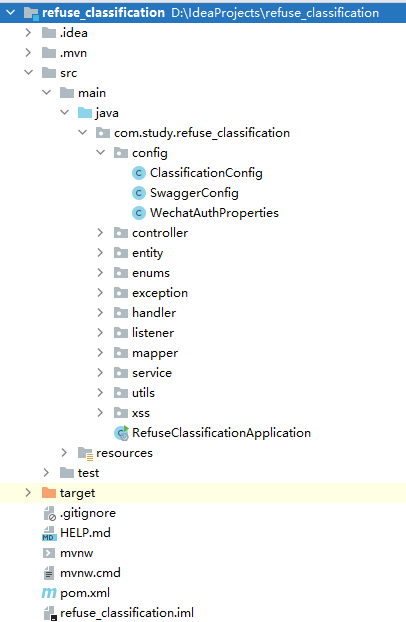

